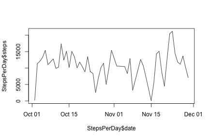
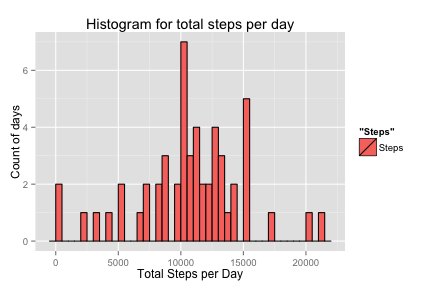
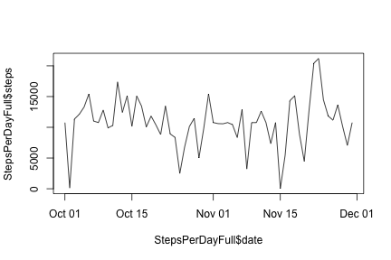
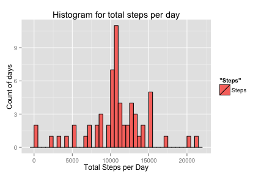
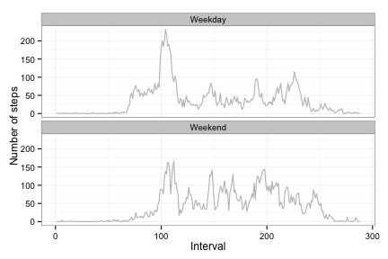

This report presents the code and results for the peer assessments 1 of the Coursera course 'Reproducible Research'.

The assignment uses data sourced from [here](https://d396qusza40orc.cloudfront.net/repdata%2Fdata%2Factivity.zip)  
The data is from an anonymous individual,and represents two months of activity (October and November 2012). It consists of the number of steps taken in five minute intervals each day.

The code and charts here represent analysis of this dataset. The code assumes that you have downloaded the file, and set your workspace to be in the same directory as the file. The libraries loaded at the beginning of the analysis were ggplot2, chron, plyr and dplyr.

##Load the libraries  


```r
library("ggplot2", lib.loc="/Library/Frameworks/R.framework/Versions/3.2/Resources/library")

library("chron", lib.loc="/Library/Frameworks/R.framework/Versions/3.2/Resources/library")

library("plyr", lib.loc="/Library/Frameworks/R.framework/Versions/3.2/Resources/library")

library("dplyr", lib.loc="/Library/Frameworks/R.framework/Versions/3.2/Resources/library")
```

```
## 
## Attaching package: 'dplyr'
## 
## The following objects are masked from 'package:plyr':
## 
##     arrange, count, desc, failwith, id, mutate, rename, summarise,
##     summarize
## 
## The following objects are masked from 'package:stats':
## 
##     filter, lag
## 
## The following objects are masked from 'package:base':
## 
##     intersect, setdiff, setequal, union
```

#Loading and preprocessing the data
First, read in the data.  

```r
ActivityData <- read.csv("activity.csv", header = TRUE, sep = ",",
                         colClasses = c("numeric","character","numeric") )
```
Then quickly check the data - the dimensions of the file, and the head & tail of it.

```r
dim(ActivityData)
```

```
## [1] 17568     3
```

```r
head(ActivityData, 10)
```

```
##    steps       date interval
## 1     NA 2012-10-01        0
## 2     NA 2012-10-01        5
## 3     NA 2012-10-01       10
## 4     NA 2012-10-01       15
## 5     NA 2012-10-01       20
## 6     NA 2012-10-01       25
## 7     NA 2012-10-01       30
## 8     NA 2012-10-01       35
## 9     NA 2012-10-01       40
## 10    NA 2012-10-01       45
```

```r
tail(ActivityData, 10)
```

```
##       steps       date interval
## 17559    NA 2012-11-30     2310
## 17560    NA 2012-11-30     2315
## 17561    NA 2012-11-30     2320
## 17562    NA 2012-11-30     2325
## 17563    NA 2012-11-30     2330
## 17564    NA 2012-11-30     2335
## 17565    NA 2012-11-30     2340
## 17566    NA 2012-11-30     2345
## 17567    NA 2012-11-30     2350
## 17568    NA 2012-11-30     2355
```
Then ensure that the date column is recognised as a date.  


```r
ActivityData$date <- as.Date(ActivityData$date, format = "%Y-%m-%d")
```

# What is the mean total number of steps taken per day?
###Summarising the data with histogram, mean and median  
Next, create a new dataframe to store the total steps per day, then populate it using the aggregate function.  


```r
StepsPerDay <- data.frame()
StepsPerDay <- aggregate(steps ~ date, ActivityData,sum)
head(StepsPerDay)
```

```
##         date steps
## 1 2012-10-02   126
## 2 2012-10-03 11352
## 3 2012-10-04 12116
## 4 2012-10-05 13294
## 5 2012-10-06 15420
## 6 2012-10-07 11015
```
Then visualise the data, to make sure there is nothing untoward in the data.  

```r
plot(StepsPerDay$date, StepsPerDay$steps, "l")
```

 
  
All appears well with the data, so now produce the histogram.  

```r
qplot(StepsPerDay$steps, geom = "histogram", binwidth = 500, 
      main = "Histogram for total steps per day",
      xlab = "Total Steps per Day",
      ylab = "Count of days",
      fill = "Steps",
      col = I("black"))
```

 
  
Then calculate the mean and median:

```r
meanStepsPerDay <- mean(StepsPerDay$steps)
medianStepsPerDay <- median(StepsPerDay$steps)

#Mean
meanStepsPerDay 
```

```
## [1] 10766.19
```

```r
#Median
medianStepsPerDay
```

```
## [1] 10765
```
  
  
##What is the average daily activity pattern?
The daily activity pattern was examined by calculating the average number of steps for each five minute interval. To do this, make sure that the interval column has been set to be a factor, then aggregate by that factor, and take a look at the first few rows of the result, to check what has been done.

```r
ActivityData$interval <- as.factor(ActivityData$interval)
StepsPerInterval <- aggregate(steps ~ interval, ActivityData,mean, na.rm = TRUE)

head(StepsPerInterval)
```

```
##   interval     steps
## 1        0 1.7169811
## 2        5 0.3396226
## 3       10 0.1320755
## 4       15 0.1509434
## 5       20 0.0754717
## 6       25 2.0943396
```

 

When in the day is this person most active? To answer this, identify the interval which contains the most steps on average:

```r
maxStepInt <- max(StepsPerInterval$steps, na.rm = TRUE)
maxStepInt
```

```
## [1] 206.1698
```

```r
maxRow <- subset(StepsPerInterval, steps == maxStepInt)
maxRow
```

```
##     interval    steps
## 104      835 206.1698
```
  
So it appears that this person has a peak of activity at 08:35am.  

#Imputing missing values

Until now, the missing data has been ignored. But should it be? How much data is missing?

```r
missingData <- sum(is.na(ActivityData$steps))
missingData
```

```
## [1] 2304
```
  
Will it make a difference to the analysis? Replace the missing data with the average for that time interval, and recalculate the mean and median.


```r
ActivityDataFull <- ActivityData 
for (i in 1:nrow(ActivityDataFull)) {
        if (is.na(ActivityDataFull$steps[i])) {
                
                #get the avg interval from StepsPerInterval
                ActivityDataFull$steps[i] <- StepsPerInterval[which(ActivityDataFull$interval[i] == StepsPerInterval$interval), ]$steps 
        }
}


StepsPerDayFull <- data.frame()
StepsPerDayFull <- aggregate(steps ~ date, ActivityDataFull, sum )
head(StepsPerDayFull)
```

```
##         date    steps
## 1 2012-10-01 10766.19
## 2 2012-10-02   126.00
## 3 2012-10-03 11352.00
## 4 2012-10-04 12116.00
## 5 2012-10-05 13294.00
## 6 2012-10-06 15420.00
```

```r
meanStepsPerDayFull <- mean(StepsPerDayFull$steps)
meanStepsPerDayFull
```

```
## [1] 10766.19
```

```r
medianStepsPerDayFull <- median(StepsPerDayFull$steps)
medianStepsPerDayFull
```

```
## [1] 10766.19
```
  
  The mean and median are now the same, where before they were a little different.
  
  Also, produce the plot again:


```r
plot(StepsPerDayFull$date, StepsPerDayFull$steps, "l")
```

 

```r
qplot(StepsPerDayFull$steps, geom = "histogram", binwidth = 500, 
      main = "Histogram for total steps per day",
      xlab = "Total Steps per Day",
      ylab = "Count of days",
      fill = "Steps",
      col = I("black"))
```

 
  
  So there is a slight difference. At the level of analysis being done here, the difference is probably not enough to matter. So for the rest of the activity patterns, use the data where missing values have been replaced.

# Are there differences in activity patterns between weekdays and weekends?
Does this person have the same activity levels on the weekends as on the weekdays? Add a factor to the dataframe that identifies if the day is a weekend or a weekday, then aggregate again, keeping the weekdays separate from the weekends.

```r
ActivityDataFull$daytype <- chron::is.weekend(ActivityDataFull$date)


#replace FALSE with weekday to make it easy to read, and make sure the data types are right 
ActivityDataFull$daytype <- as.factor(ActivityDataFull$daytype)
ActivityDataFull$interval <- as.numeric(ActivityDataFull$interval)
ActivityDataFull$steps <- as.numeric(ActivityDataFull$steps)

ActivityDataFull$daytype <- revalue(ActivityDataFull$daytype, c("FALSE" = "Weekday", "TRUE" = "Weekend"))
head(ActivityDataFull)
```

```
##       steps       date interval daytype
## 1 1.7169811 2012-10-01        1 Weekday
## 2 0.3396226 2012-10-01        2 Weekday
## 3 0.1320755 2012-10-01        3 Weekday
## 4 0.1509434 2012-10-01        4 Weekday
## 5 0.0754717 2012-10-01        5 Weekday
## 6 2.0943396 2012-10-01        6 Weekday
```

```r
intervalsDayType <- aggregate(steps ~ daytype + interval, ActivityDataFull, FUN = mean)
head(intervalsDayType)
```

```
##   daytype interval      steps
## 1 Weekday        1 2.25115304
## 2 Weekend        1 0.21462264
## 3 Weekday        2 0.44528302
## 4 Weekend        2 0.04245283
## 5 Weekday        3 0.17316562
## 6 Weekend        3 0.01650943
```
  
Now produce a plot where the weekdays and the weekends activity patterns can be visually compared.

```r
ggplot(intervalsDayType, aes(x=interval, y=steps)) +
        geom_line(color = "grey") + 
        facet_wrap(~ daytype, nrow=2, ncol=1) +
        labs(x="Interval", y="Number of steps") +
        theme_bw()
```

 
  
  It looks like there is a difference in the activity patterns. Overall, this person appears to be more active on weekends, with a later start in the morning to the activity. The weekends do not have as high a spike in activity levels at around 08:30am.
